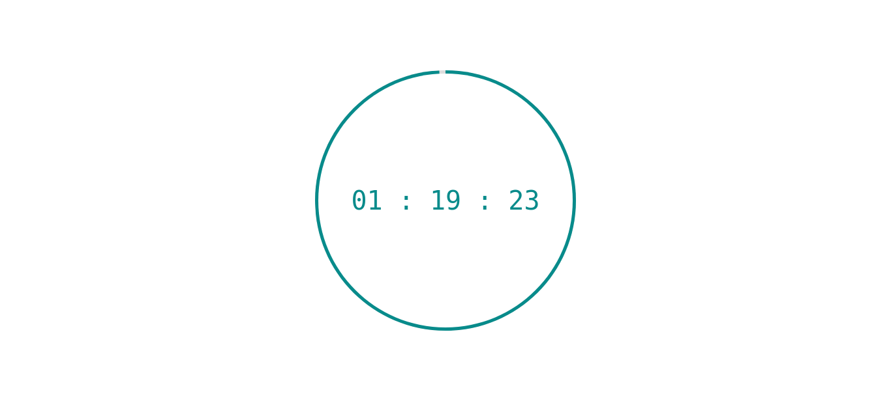
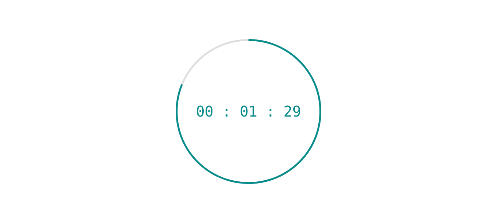

# MAKING Pomodoro Clock WITH JAVASCRIPT

## Table of contents

- Overview: 
    Making count down timer with JavaScript ;

- The-challenge:
    My problem was how should take time and decreases time 

- Screenshot:
    
    

    

- Builtwith:
    Html, Css, JavaScript
  
- What I learned:
    After some searching and watching youtube video I found out how should I take the time and decrease it, actauly we can make a variable and equal it to Date.now then make another variable for puttin the time I want for countdown based on millisecond and added together.
    Now we made Future variable after that we describe another variabel and eqaul it to
    Date.now and decreases from future variable and use interval to call it every one second. 

- Author:
    Mohammad Reza Dargi

### Continued development

-In next project i will make Weather App with Html, Css, JavaScript.

## Author

- Name & Family name: Mohammad Reza Dargi
- Github: mr-dargi

